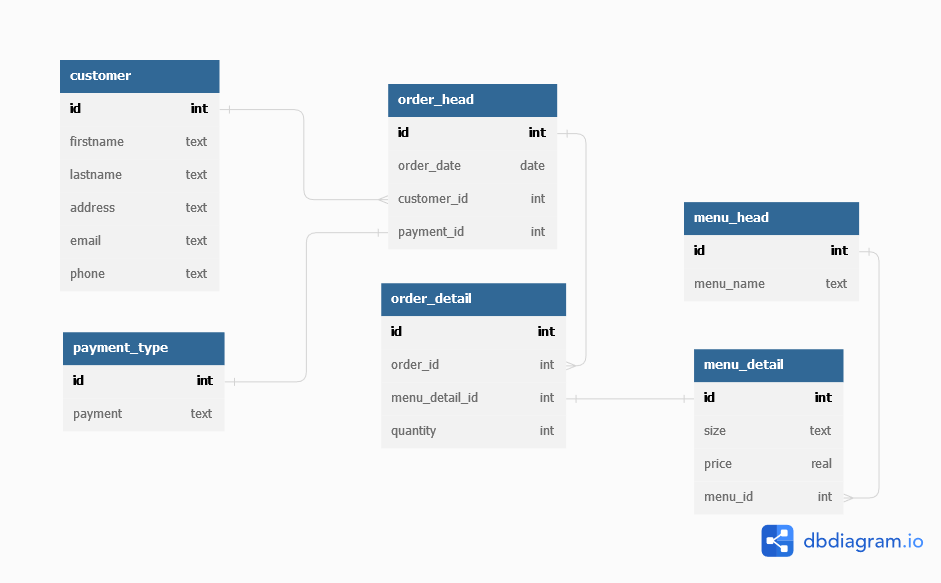

# SQL

[HW SQL](https://replit.com/@cchayanin/SQLhomeworkbatch5)

## SQLite:

Restaurant databases at least 5 tables
- customer
- menu_head
- menu_detail
- payment_type
- order_head
- order_detail

[DBML](./restaurant.dbml)

Query & subquery with cte

[SQL](hw_sql_batch5.sql)